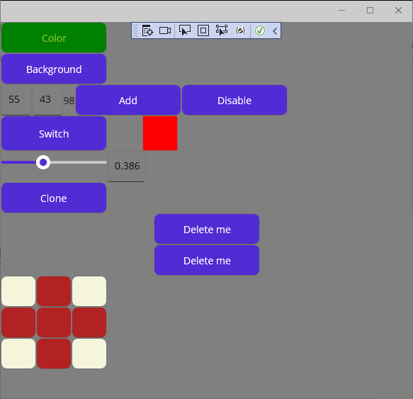

# EVIP_MAUI

## Felkészülés a laborra

- Lásd Moodle
- MAUI App készítési alapok:
    - https://docs.microsoft.com/en-us/dotnet/maui/get-started/first-app?pivots=devices-windows
- MAUI elrendezés:
    - https://docs.microsoft.com/en-us/dotnet/maui/user-interface/pages/contentpage
    - https://docs.microsoft.com/en-us/dotnet/maui/user-interface/layouts/
- MAUI vezérlõk:
    - https://docs.microsoft.com/en-us/dotnet/maui/user-interface/controls/

## Hibajavítás

Az App tesztelésénél, ha fura "missing assembly" hibákat kapunk, akkor egy "Build -> Clean Solution" segíthet.

## Leírás

(A labor elején, már most hozz létre egy új branchet és utána azon dolgozz, hogy a pull requestet könnyû legyen majd a labor végén létrehozni!
És ha az egyetemen kezdted el a munkát, mielõtt elmész, ne felejtsd el felpusholni a változásokat a laborgéprõl a githubra!)

Elõször is hozzunk létre egy üres MAUI projektet (Create a new project -> Blank App (.NET MAUI)).


A MainPage.xaml fájl az app megjelenítésének leírója, a MainPage.xaml.cs a hozzá tartozó C# kód ("code-behind").
Minden megjelenõ elem a Page címkén belül helyezkedik el (\<ContentPage> ... \</ContentPage>). Az elsõ (õs) elem tipikusan egy elrendezésért felelõs címke, ilyenek pl.:

- Négyzetrácsos elhelyezés (\<Grid> ... \</Grid>)
- Elemek egymás utáni helyezése (\<StackLayout> ... \</StackLayout>)
- Elemek egymáshoz képesti pozicionálása (\<AbsoluteLayout> ... \</AbsoluteLayout>)

Minden címke tartalmazhat tulajdonságokat, például amik a nevét, méretét, színét, tartalmát, elhelyezkedését stb. határozzák meg.
Ha nem adunk meg egy tulajdonságot, akkor az alapértelmezett értéken marad. StackPanel használatánál megadhatjuk, hogy vízszintesen,
vagy függõlegesen helyezkedjenek-e el bennük az elemek:

A három gomb egymás alatt helyezkedik el:

```html
<StackLayout Orientation="Vertical">
    <Button x:Name="firstBtn" Text="First" WidthRequest="100" />
    <Button x:Name="secondBtn" Text="Second" WidthRequest="100" />
    <Button x:Name="thirdBtn" Text="Third" WidthRequest="100" />
</StackLayout>
```

A három gomb egymás mellett helyezkedik el:

```html
<StackLayout Orientation="Horizontal">
    <Button x:Name="firstBtn" Text="First" WidthRequest="100" />
    <Button x:Name="secondBtn" Text="Second" WidthRequest="100" />
    <Button x:Name="thirdBtn" Text="Third" WidthRequest="100" />
</StackLayout>
```

Az egyes elemek név (x:Name="") beállításával a MainPage.xaml.cs kódból elérhetjük az adott elem objektumát és tulajdonságait.
Az elõzõ példából kiindulva az elsõ gomb szövegszínének és háttérszínének kódból történõ állítása így nézne ki:

```cs
    public MainPage()
    {
        this.InitializeComponent();

        firstBtn.TextColor =Colors.YellowGreen;
        firstBtn.Background = new SolidColorBrush(Colors.Green);
    }
```

Az egyes tulajdonságok módosításának módját - ha nem egyértelmû, akkor - egy gyors google kereséssel érthetjük meg.

### Eseménykezelés

Egy felhasználói felület mûködése során egér- és billentyûzet-eseményekre kell reagálnia. Ilyen események az egér mozgatása, kattintása,
a billentyûzet lenyomása stb. Események regisztálása szintén tulajdonságok beállításával történik. Visual Studioban ha kurzorral egy adott elemen állunk,
akkor a "Properties" ablak (F4-el elõhozható) villám alakú ikonra  kattintva láthatjuk a lehetséges események listáját. A "Properties" ablakban
a regiszrálni kívánt eseménynél (pl. "Clicked" eseménynél), ha az üres mezõbe duplán klikkelünk, akkor a MainPage.xaml.cs fájlban megjelenik az esemény tüzelésekor meghívódó függvény:

```html
    <Button Name="firstBtn" Content="First" Width="100" Clicked="FirstBtn_Click" />
```
```cs
    private void FirstBtn_Click(object sender, EventArgs e)
    {

    }
```

## Feladatok

LAB07_MAUI_Basics\\01 mappában, a most elkészített projektben dolgozzatok. Minden létrehozott gomb egységes méretû legyen, legyen neve, és tartalmazzon szöveget.
Az elemek egymás alatt helyezkedjenek el.

- Hozz létre egy gombot amire ráklikkelve megváltozik a szöveg színe és a gomb háttérszíne.
- Hozz létre egy gombot amire ráklikkelve az ablak háttérszíne két szín között váltogat (minden kattintásra egy váltás).
- Hozz létre két szövegdobozt (Entry), egy címkét (Label), és két gombot:
    - Ezek az elemek egy sorban helyezkedjenek el.
    - Az elsõ gomb megnyomására a két szövegdobozba beírt számok összegét írja ki a címkébe (itt fontos a hibakezelés).
    - A második gomb megnyomására a két szövegdoboz tiltódjon le, ne lehessen beléjük szöveget írni ("IsEnabled" tulajdonság).
- Hozz létre egy gombot, és három négyzetet (Rectangle):
    - Ezek az elemek egy sorban helyezkedjenek el.
    - Gomb nyomogatására egy szín lépkedjen a négyzeteken sorban, ha végigért a soron akkor kezdje újra az elejétõl.
- Hozz létre egy csúszkát és egy szövegdobozt:
    - Ezek az elemek egy sorban helyezkedjenek el.
    - A csúszka változására a szövegdoboz folyamatosan frissüljön a csúszka értékével.
    - A szövegdoboz változására is változzon megfelelõen a csúszka értéke.
    - A szövegdobozba csak számot lehessen beírni.
- Hozz létre egy gombot, amire ráklikkelve alatta egy olyan új gomb jelenik meg, amire ha ráklikkelsz eltûnik. Segítség: egy elemhez hozzá lehet adni, és ki lehet törölni gyerek elemeket a \<szülõ elem név>.Children lista segítségével. Egy elemhez tartozó eseményre a += operátor segítségével (egy delegate "függvény mutatóval") iratkozhatunk fel:

```cs
{
    btn.Clicked += Btn_Click;
}

private void Btn_Click(object sender, EventArgs e)
{
    ...
}
```

- MainPage osztályon belül programozottan hozz létre 3x3 gombot mátrixba rendezve (3 sor, 3 oszlop), mindegyik ugyanolyan háttérszínû legyen, egy space karakter legyen a szövegük:
    - Ezek a gombok két háttérszín között váltakozzanak a következõ szerint: ha az egyik gombra ráklikkelsz akkor annak és a közvetlen (merõleges) szomszédainak a színe ellenkezõvé kell változzon.
    - A klikkelés eseményhez tartozó logikához mindösszesen egy darab közös függvényre van szükség, ez úgy oldható meg, hogy ha a "sender" argumentumot vizsgáljátok (ez az eseményt kiváltó gomb objektuma, tehát: Button btn = (Button)sender;).
    - A megoldáshoz szükség lesz egy 2D Button tömbre (Button[,] gridButtons = new Button[3,3]), a dinamikusan létrehozott új gombokat ebben kell eltárolni. Ha az egyikre ráklikkelünk, akkor meg kell keresni a klikkelt gombnak a tömbben lévõ pozícióit (x,y koordinátáit), ha ezek megvannak, akkor meg kell vizsgálni, hogy a 2D tömbben x és y irányban vannak-e szomszédok, ha igen akkor azoknak is színt kell váltani.
    - Ha minden gombnak megváltozott a színe, akkor írjon ki egy üzenetet (ezt minden gombnyomáskor érdemes megvizsgálni). Az üzenet kiírása így történhet:
```cs
     DisplayAlert("","You won!","OK");
```

A feladatok megoldásához egy példa:


